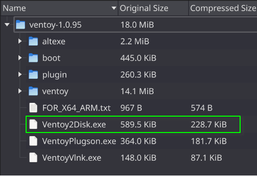
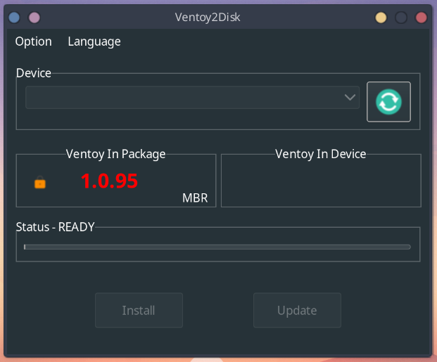
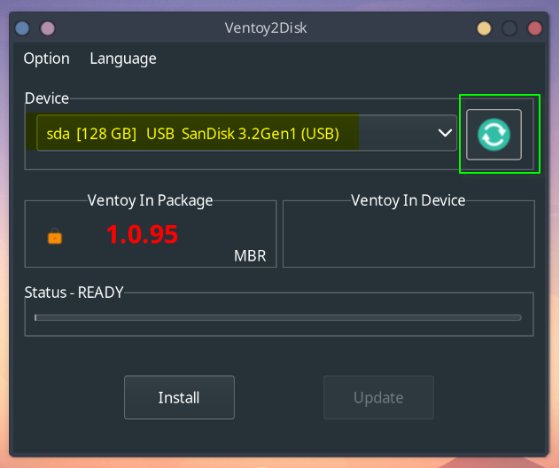
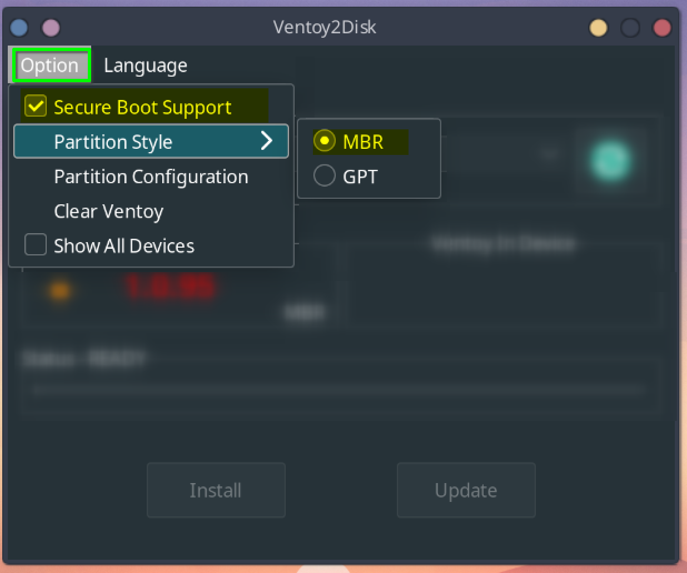
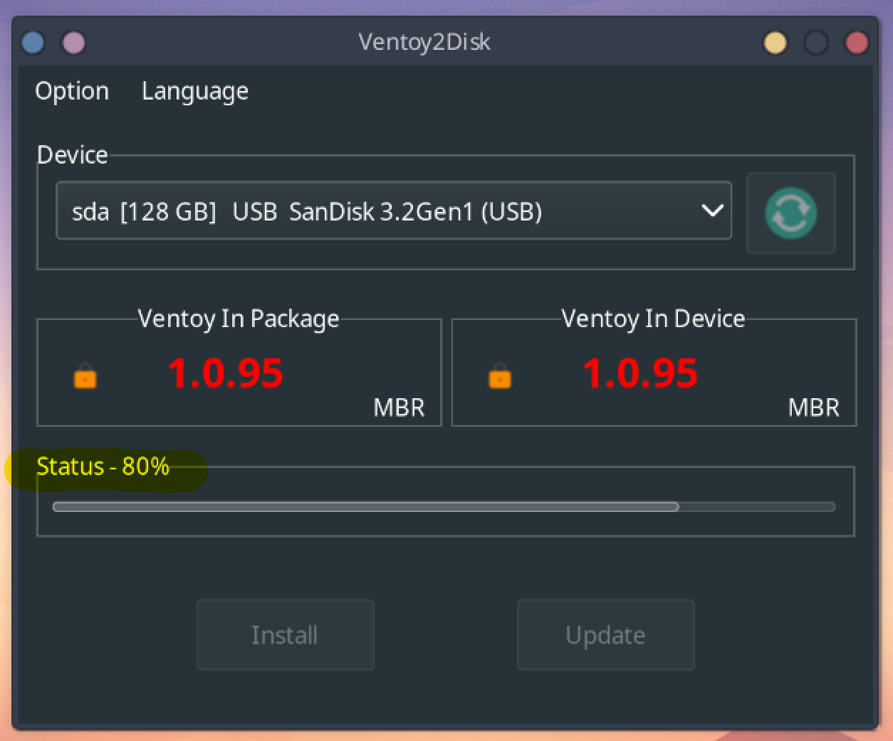
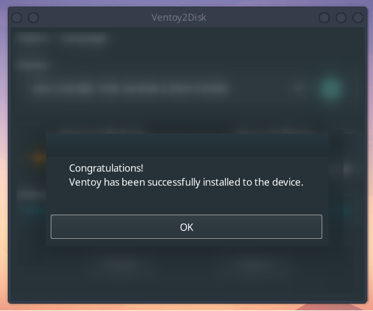
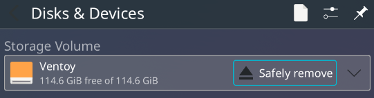
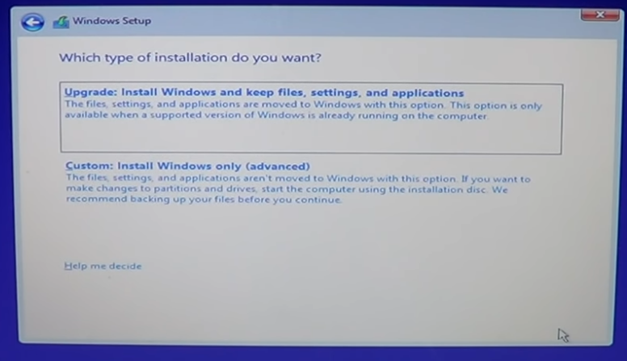
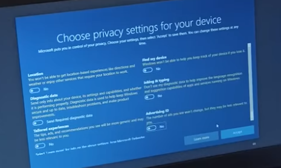

# Windows 10 installation guide

## Requirements:
- Empty Pendrive (atleast 16GB). Pendrive will be formatted during the process!
- Windows 10 iso. [Click to download](https://software.download.prss.microsoft.com/dbazure/Win10_22H2_EnglishInternational_x64v1.iso?t=3fd9b83f-d6f7-4958-9e8e-3e3fbbc15788&e=1694836849&h=3dd34f0f5799e60fe4cd7dfcd3ec315d3c249bedbfc663d770bf3eeaed7f1ff9)
- Ventoy (Windows app). [Click to download](https://github.com/ventoy/Ventoy/releases/download/v1.0.95/ventoy-1.0.95-windows.zip)
- Installation Target (PC to install win 10 on) PC too will be formatted during the process! Make sure to backup files before proceding!
- Another laptop. (To create bootable usb. This one won't be formatted or anything)

## Preparation Steps: (Laptop)
1. Create a folder and paste windows 10 iso and ventoy zip both files into this folder. (for convenience)
2. Exctract ventoy__.zip
3. Right click on `Ventoy2Disk.exe` and open as administrator.
4. 
   
5. It should look like this.
6.  
   
7. Now connect your pendrive and click the green refresh button. Your pendrive will now be visible under `Device`.
8. 
   
9. Click on Option tab on top left side of the window and select/set these options.
10. 
    
11. Once ready, hit the `Install` button. Click `Ok` in following prompts and wait for the process to be completed.
12. 
    
13. Once completed, you will be notified with this prompt.
14. 
    
15. Hit `OK` and close the window.
16. Finally, eject your pendrive from task manager. (You may see 2 devices, eject any one, the other will be ejected simultaneously).
17. 
    

## Installation Instructions: (PC)
### Call imdly if you have doubts or face any issues (these are critical steps)

### Next steps, yet to be explained.
- Disable secure boot in bios (https://youtu.be/brXcxmdWU9Q?t=17)
- boot from pendrive (https://www.youtube.com/watch?v=wH9q3KSISvQ)
- go through base setup (language and terms. select windows 10 pro if prompted with list). DO NOT SIGN INTO A MICROSOFT ACCOUNT!
- disk partitioning (`call me during this`)
- 

- completing setup (toggle off all options. privacy nightmare!)
- 

- now continue setup
- done.

`Author: Arnav Padwal`
